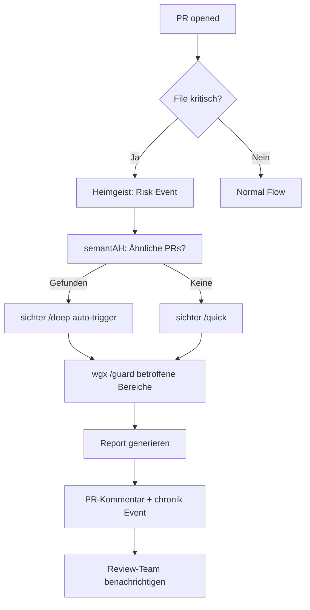
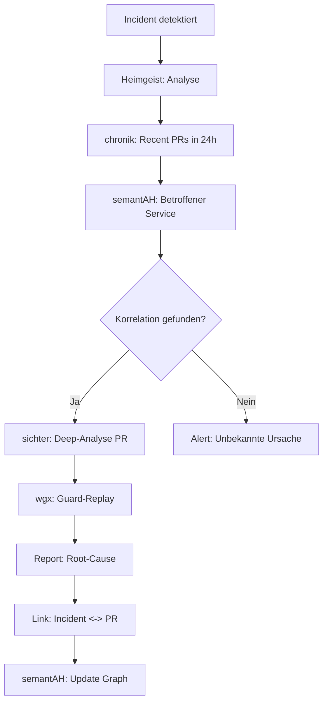
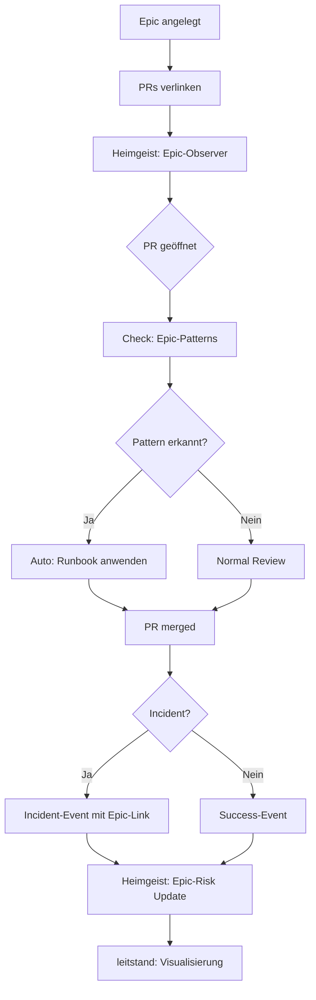

# Heimgewebe Pipeline – Praktischer Einsatz

**Wie du die neue Pipeline wirklich sinnvoll einsetzt – kein Spielerei-Gimmick**

## Die fünf harten Einsatzmuster

### 1. PR-Command-Bus statt bunter Mentions

**Problem**: Jeder macht seine eigenen Conventions für PR-Kommentare.

**Lösung**: Feste Command-Sprache über `@heimgewebe/[tool] /[command]`

```
# ❌ Alt: Chaotisch
"Can someone review this?"
"@john please check security"
"CI is failing, help!"

# ✅ Neu: Strukturiert
@heimgewebe/sichter /quick
@heimgewebe/wgx /guard changed
@heimgewebe/heimlern /pattern-bad sql-injection
```

The example above already uses the Heimgewebe command language that Heimgeist understands.

For a full reference of supported tools, commands and arguments, see:

- [`docs/command-language.md`](./command-language.md)

**Technisch**:
1. Dispatcher erkennt `@heimgewebe/` mentions
2. Parst Command-Syntax: `tool` + `command` + `args`
3. Schreibt `heimgewebe.command.v1` Event nach chronik
4. Tool wird asynchron getriggert
5. Ergebnis kommt als Event zurück und wird kommentiert

**Nutzen**:
- Alle Kommandos sind im Event-Log (chronik)
- Statistiken: "Wie oft wurde /guard aufgerufen?"
- Debugging: "Was wurde wann wo getriggert?"
- Audit: "Wer hat welche Checks angestoßen?"

### 2. Heimgeist als permanenter Risiko-Scanner

**Problem**: Niemand checkt systematisch, ob ein PR ähnlich zu problematischen früheren PRs ist.

**Lösung**: Heimgeist liest CI-Ergebnisse, PR-Events, Incidents und vergleicht mit semantAH-Historie.

```typescript
// Automatischer Flow (Autonomy Level 2+)
PR geöffnet
  ↓
Event: pr.opened
  ↓
Heimgeist (Observer): "Neuer PR in metarepo"
  ↓
semantAH Query: "Finde ähnliche PRs in letzten 6 Monaten"
  ↓
Result: PR #42, PR #38 (beide hatten Incidents)
  ↓
Heimgeist (Critic): "HIGH RISK - ähnlich zu 2 Problem-PRs"
  ↓
Heimgeist (Director): "Action: sichter /deep + wgx /guard"
  ↓
Heimgeist (Archivist): Schreibt Risk-Event nach chronik
  ↓
PR-Kommentar: "⚠️ High-Risk PR - similar to incidents #42, #38"
```

**Konkrete Policies**:

```yaml
# .heimgeist/policies/critical-files.yml
critical_files:
  - path: "src/auth/**"
    reason: "Authentication layer - high incident rate"
    action:
      - tool: wgx
        command: /guard
        params: [auth]
      - tool: sichter
        command: /deep
        params: [security-focus]
  
  - path: "database/migrations/**"
    reason: "Migrations - production risk"
    action:
      - tool: sichter
        command: /compare
        params: [last-successful-migration]
  
  - path: "config/production.yml"
    reason: "Production config - no mistakes allowed"
    action:
      - require_review: [security-team, sre-team]
      - tool: wgx
        command: /smoke
        params: [staging]
```

**Nutzen**:
- WGX-Profile, Contracts, hausKI-Policies werden nur noch mit Risiko-Bewertung geändert
- Kein "by gut feeling" mehr
- Jede kritische Änderung hat Alternativplan

### 3. Sichter + semantAH als Entscheidungsarchiv

**Problem**: "Haben wir das schon mal gehabt? Wie haben wir das gelöst?"

**Lösung**: Sichter-Analysen und Heimgeist-Risiko-Assessments gehen als Reports und Knoten in semantAH.

```typescript
// Nach Sichter-Analyse
const report = {
  pr: 123,
  risk_level: 'high',
  affected_layers: ['api', 'database'],
  similar_prs: [42, 38],
  recommendations: [
    'Add integration tests',
    'Review database indices',
    'Consider feature flag'
  ]
};

// Zu semantAH
await semantAH.addNode({
  type: 'sichter-report',
  id: `report-pr-${report.pr}`,
  properties: report
});

// Kanten zu verwandten PRs
for (const similarPR of report.similar_prs) {
  await semantAH.addEdge({
    from: `pr-${report.pr}`,
    to: `pr-${similarPR}`,
    type: 'similar_to',
    weight: 0.8
  });
}
```

**Query-Beispiele**:

```typescript
// "Welche PRs hatten ähnliche Risiken?"
const similarRisks = await semantAH.query({
  type: 'sichter-report',
  where: {
    risk_level: 'high',
    affected_layers: { contains: 'database' }
  },
  limit: 10
});

// "Wie oft haben wir DB-Migration-Issues gefixt?"
const fixes = await semantAH.query({
  path: [
    { type: 'sichter-report', where: { affected_layers: 'database' } },
    { edge: 'led_to', type: 'incident' },
    { edge: 'fixed_by', type: 'pr' }
  ]
});

// "Was war die durchschnittliche Fix-Zeit?"
const avgTime = fixes.reduce((sum, fix) => {
  const incidentTime = new Date(fix.incident.timestamp);
  const fixTime = new Date(fix.fix_pr.merged_at);
  return sum + (fixTime - incidentTime);
}, 0) / fixes.length;
```

**Nutzen**:
- Echte Lernschleifen statt Ad-hoc-Patches
- "Institutional Memory" im Code
- Neue Entwickler bekommen automatisch Kontext

### 4. Epics, Incidents und Patterns als First-Class-Events

**Problem**: Große Umbauten und Störungen werden nicht systematisch getrackt.

**Lösung**: Epic-, Incident- und Pattern-Events durch die Pipeline schieben.

```typescript
// Epic anlegen
await chronik.write({
  type: 'epic.linked',
  payload: {
    epic_id: 'EPIC-123',
    title: 'Migrate to new Auth System',
    linked_prs: [],
    phase: 'planning'
  }
});

// PRs dem Epic zuordnen
@heimgewebe/metarepo /link-epic EPIC-123

// Automatische Incident-Detection
await chronik.write({
  type: 'incident.detected',
  payload: {
    severity: 'high',
    description: 'Auth service down',
    affected_services: ['api', 'worker'],
    potential_cause: {
      recent_changes: ['pr-87', 'pr-89']
    }
  }
});

// Pattern markieren
@heimgewebe/heimlern /pattern-bad "SQL without prepared statements"
@heimgewebe/heimlern /pattern-good "Using TypeORM query builder"
```

**Heimgeist Epic-Tracking**:

```typescript
// Über Monate hinweg
heimgeist.on('epic.linked', async (event) => {
  const epic = event.payload;
  
  // Sammle alle Events zu diesem Epic
  const relatedEvents = await chronik.query({
    where: {
      or: [
        { type: 'pr.opened', payload: { epic_id: epic.epic_id } },
        { type: 'pr.merged', payload: { epic_id: epic.epic_id } },
        { type: 'incident.detected', payload: { epic_id: epic.epic_id } }
      ]
    }
  });
  
  // Analyse
  const incidents = relatedEvents.filter(e => e.type === 'incident.detected');
  const prs = relatedEvents.filter(e => e.type.startsWith('pr.'));
  
  if (incidents.length > 3) {
    heimgeist.createInsight({
      type: 'pattern',
      severity: 'high',
      title: `Epic ${epic.title} has high incident rate`,
      description: `${incidents.length} incidents from ${prs.length} PRs`,
      recommendations: [
        'Review Epic scope and complexity',
        'Consider breaking into smaller Epics',
        'Add more integration tests',
        'Schedule retrospective'
      ]
    });
  }
});
```

**Nutzen**:
- Muster über Monate aufspannen
- "Welche Umbauten haben viele Incidents produziert?"
- "Welche Patterns sind 'good' und sollten in Templates?"

### 5. GitHub als austauschbare Hülle

**Problem**: Vendor-Lock-In an GitHub.

**Lösung**: Alle Logik über Events und Adapter, GitHub ist nur UI.

```typescript
// Core-Logik ist GitHub-agnostisch
class HeimgewebeCore {
  async processCommand(command: Command): Promise<Result> {
    // Keine GitHub-Abhängigkeit hier
    const event = {
      type: 'heimgewebe.command.v1',
      payload: command
    };
    
    await chronik.write(event);
    return await this.executeCommand(command);
  }
}

// GitHub-Adapter
class GitHubAdapter extends PlatformAdapter {
  async onComment(comment: GitHubComment) {
    const command = this.parseComment(comment);
    const result = await core.processCommand(command);
    await this.postComment(result);
  }
}

// Forgejo-Adapter (Zukunft)
class ForgejoAdapter extends PlatformAdapter {
  async onComment(comment: ForgejoComment) {
    const command = this.parseComment(comment);
    const result = await core.processCommand(command);
    await this.postComment(result);
  }
}

// Gitea-Adapter (Zukunft)
class GiteaAdapter extends PlatformAdapter {
  async onComment(comment: GiteaComment) {
    const command = this.parseComment(comment);
    const result = await core.processCommand(command);
    await this.postComment(result);
  }
}
```

**Adapter-Interface**:

```typescript
interface PlatformAdapter {
  // Events von Platform zu Heimgewebe
  onComment(comment: Comment): Promise<void>;
  onPROpened(pr: PullRequest): Promise<void>;
  onPRMerged(pr: PullRequest): Promise<void>;
  onCIResult(result: CIResult): Promise<void>;
  
  // Events von Heimgewebe zu Platform
  postComment(text: string, target: Target): Promise<void>;
  setLabel(label: string, target: Target): Promise<void>;
  requestReview(reviewer: string, target: Target): Promise<void>;
  updateStatus(status: Status, target: Target): Promise<void>;
}
```

**Nutzen**:
- Heute GitHub, morgen Forgejo, übermorgen eigene Oberfläche
- Logik, Wissen, Reflexion in Heimgeist + semantAH + chronik
- Platform ist austauschbar

## Konkrete Workflows

### Workflow 1: High-Risk PR Review



### Workflow 2: Incident Response



### Workflow 3: Epic Tracking



## Metriken und KPIs

### Was du messen solltest

```yaml
metrics:
  # Pipeline-Nutzung
  - command_count:
      by_tool: [sichter, wgx, heimlern, metarepo]
      by_user: true
      timeframe: week
  
  # Risiko-Prävention
  - high_risk_prs_detected: count
  - incidents_prevented: 
      method: compare_with_similar_prs
  - false_positives: 
      method: user_feedback
  
  # Learning-Loops
  - patterns_recorded: 
      good: count
      bad: count
  - patterns_applied: count
  - template_generations: count
  
  # Response-Zeit
  - incident_to_root_cause: duration
  - pr_to_first_analysis: duration
  - risk_detection_to_action: duration
  
  # System-Health
  - event_processing_lag: duration
  - semantAH_query_time: duration
  - heimgeist_insight_rate: per_hour
```

### Dashboard (leitstand)

```typescript
// Beispiel: Echtzeit-Dashboard
const dashboard = {
  overview: {
    active_prs: 12,
    pending_reviews: 5,
    high_risk_prs: 2,
    open_incidents: 1,
    active_epics: 3
  },
  
  recent_events: [
    { time: '10:23', type: 'pr.opened', pr: 142, risk: 'medium' },
    { time: '10:18', type: 'heimgeist.insight', severity: 'high', title: 'Repetitive failures' },
    { time: '10:15', type: 'wgx.guard.completed', pr: 141, status: 'passed' }
  ],
  
  risk_heatmap: {
    repos: {
      'heimgewebe/metarepo': 'high',
      'heimgewebe/wgx': 'low',
      'heimgewebe/semantAH': 'medium'
    },
    files: {
      'src/auth/': 'critical',
      'src/api/': 'high',
      'src/utils/': 'low'
    }
  },
  
  epic_progress: [
    { id: 'EPIC-123', title: 'New Auth', progress: 0.65, risk: 'medium', prs: 8 },
    { id: 'EPIC-124', title: 'API v2', progress: 0.30, risk: 'low', prs: 3 }
  ]
};
```

## Rollout-Strategie

### Phase 1: Beobachten (2 Wochen)

```yaml
config:
  autonomy_level: 1  # Observing
  active_roles: [observer, archivist]
  
actions:
  - Dispatcher läuft, schreibt Events
  - Heimgeist beobachtet, keine Actions
  - Metriken sammeln: Wie oft würde er reagieren?
  - Team-Feedback: Sind die Erkenntnisse nützlich?
```

### Phase 2: Warnen (4 Wochen)

```yaml
config:
  autonomy_level: 2  # Warning
  active_roles: [observer, critic, archivist]
  
actions:
  - Heimgeist schreibt Kommentare auf PRs
  - Actions müssen approved werden
  - Sammle False-Positive-Rate
  - Tune Policies basierend auf Feedback
```

### Phase 3: Operativ (Ongoing)

```yaml
config:
  autonomy_level: 3  # Operative
  active_roles: [observer, critic, director, archivist]
  policies:
    - name: auto-guard-critical-files
      enabled: true
    - name: auto-sichter-high-risk
      enabled: true
  
actions:
  - Heimgeist startet Tools automatisch
  - Nur bei kritischen Insights: Manual Review
  - Continuous Tuning basierend auf Outcomes
```

## Troubleshooting

### "Zu viele False Positives"

**Problem**: Heimgeist warnt zu oft bei harmlosen PRs.

**Lösung**:
1. Check Policy-Thresholds in `.heimgeist/policies/`
2. Verbessere Pattern-Matching in semantAH
3. Füge Whitelist für bekannte harmlose Patterns hinzu
4. Sammle User-Feedback als Training-Data für heimlern

### "Events werden nicht verarbeitet"

**Problem**: Dispatcher schreibt Events, aber nichts passiert.

**Lösung**:
1. Check chronik Connectivity
2. Check Heimgeist Status: `heimgeist status`
3. Check Event-Processing-Lag Metric
4. Review Logs: `heimgeist logs --level error`

### "semantAH Queries sind langsam"

**Problem**: Context-Retrieval dauert zu lange.

**Lösung**:
1. Index optimieren für häufige Queries
2. Caching-Layer einführen
3. Query-Batching implementieren
4. Async-Processing wo möglich

## Zusammenfassung

Die Pipeline ist kein "Mention-Gimmick", sondern:

✅ **Rückgrat eines lernenden Systems**
✅ **Schutz vor Wiederholungsfehlern**
✅ **Transparente Entscheidungsfindung**
✅ **Host-unabhängige Intelligenz**
✅ **Praktisch nutzbar von Tag 1**

**Der Unterschied**: Andere Systeme sind Tools. Heimgewebe ist ein Organismus, der dich aktiv vor Blindspots und chaotischer CI schützt.
